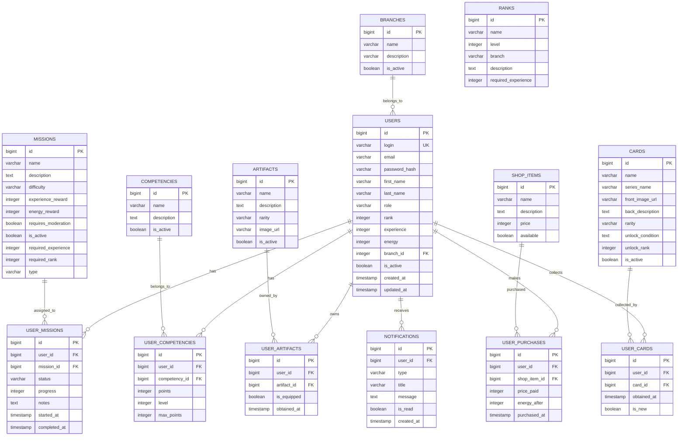
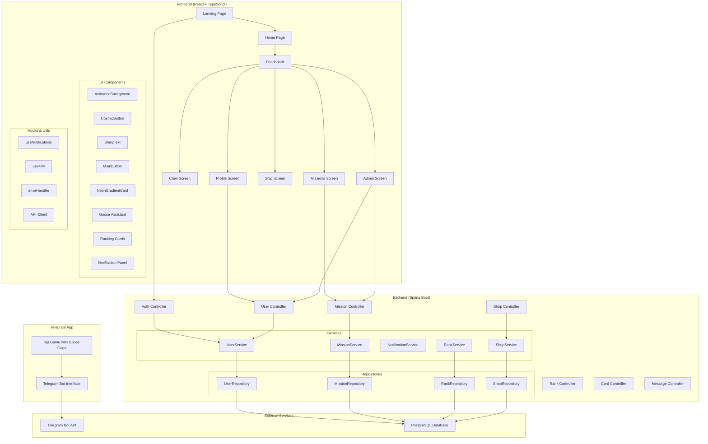

#  Alabuga.TECH

> Космическая платформа для развития и мотивации

[](https://liambx.com/erd/p/linskay.github.io/alabuga/schema.sql)
[](https://openjdk.java.net/)
[](https://spring.io/projects/spring-boot)
[](https://reactjs.org/)
[](https://www.typescriptlang.org/)
[](https://maven.apache.org/)
[](https://www.docker.com/)
[](https://www.liquibase.org/)
[](https://www.postgresql.org/)
[](https://tailwindcss.com/)
[](https://www.framer.com/motion/)
[](https://core.telegram.org/bots/api)

## 📋 Содержание

- [Быстрый старт](#-быстрый-старт)
- [Архитектура](#-архитектура)
- [Реализованные механики](#-реализованные-механики)
- [Планы развития](#-планы-развития)
- [API документация](#-api-документация)

## 🚀 Быстрый старт

### Предварительные требования

- Java 17+
- Node.js 18+
- Docker & Docker Compose
- Maven 3.9+

### Запуск проекта

1. **Клонируйте репозиторий**
   ```bash
   git clone <repository-url>
   cd alabuga
   ```

2. **Запустите тестовую базу данных**
```bash
docker-compose up -d
```

3. **Запустите backend (Java)**
```bash
   cd backend
   mvn spring-boot:run
   ```
   - При первом запуске автоматически применятся миграции Liquibase
   - API будет доступно на `http://localhost:8080`

4. **Запустите frontend (React)**
```bash
   cd frontend
   npm install
   npm start
   ```
   - Приложение будет доступно на `http://localhost:3000`

### Тестовые пользователи

Для простоты тестирования используйте заглушку авторизации:
- Введите любой логин (например: `admin`, `user`, `test`)
- Нажмите "Войти" - система автоматически создаст пользователя

## 🏗️ Архитектура

### База данных (ERD)

[](https://liambx.com/erd/p/linskay.github.io/alabuga/schema.sql)



### Компонентная диаграмма приложения



## ⚡ Реализованные механики

### 🎯 Система пользователей и ролей
- **Авторизация**: Упрощённая система с заглушкой для тестирования
- **Роли**: ADMIN, USER с разными уровнями доступа
- **Профили**: Полная информация о пользователе, статистика, компетенции
- **Ветки развития**: Различные направления карьерного роста

### 🏆 Система рангов и опыта
- **Ранги**: 11 уровней от "Космо-Кадета" до "Хранителя Станции"
- **Опыт**: Начисление за выполнение миссий и активность
- **Прогресс-бары**: Визуализация прогресса до следующего ранга
- **Требования**: Система требований для повышения ранга

### 🎮 Система миссий
- **Типы миссий**: Различные категории с разной сложностью
- **Статусы**: NOT_STARTED, IN_PROGRESS, COMPLETED, FAILED
- **Модерация**: Миссии, требующие подтверждения администратора
- **Награды**: Опыт и энергон за выполнение
- **Прогресс**: Отслеживание выполнения с заметками

### 💎 Система компетенций
- **9 базовых компетенций**: От "Силы Миссии" до "Курса Аэронавигации"
- **Уровни**: Прокачка от 0 до 500 очков
- **Визуализация**: Прогресс-бары с анимацией
- **Подсказки**: Описания каждой компетенции

### 🛸 Система артефактов
- **Коллекционирование**: Различные артефакты с редкостью
- **Экипировка**: Возможность экипировать артефакты
- **Визуализация**: Карточки с изображениями и описаниями
- **Редкость**: Система редкости артефактов

### 🛒 Магазин
- **Товары**: Различные предметы за энергон
- **Покупки**: История покупок пользователя
- **Энергон**: Внутренняя валюта системы
- **Доступность**: Управление доступностью товаров

### 🃏 Система карт
- **Коллекционирование**: Карты по сериям
- **Редкость**: Различные уровни редкости
- **Условия разблокировки**: Требования для получения
- **Новые карты**: Отметка о новых полученных картах

### 📊 Рейтинг и статистика
- **Общий рейтинг**: По опыту за всё время
- **Недельный рейтинг**: По опыту за последние 7 дней
- **Топ-3**: Специальные карточки для лидеров
- **Таблица**: Полный рейтинг с бейджами для топ-10

### 🔔 Система уведомлений
- **Типы**: Различные категории уведомлений
- **Прочтение**: Отметка о прочтении
- **История**: Сохранение всех уведомлений
- **Панель**: Удобный интерфейс для просмотра

### 🎨 UI/UX компоненты
- **Анимации**: Framer Motion для плавных переходов
- **Космическая тематика**: Единый стиль интерфейса
- **Адаптивность**: Поддержка различных устройств
- **Тёмная тема**: Космический дизайн

### 🦆 Гусь-помощник
- **Мотивация**: 60+ фраз для мотивации пользователей
- **Рандомность**: Появление раз в 2 минуты
- **Персонализация**: Приветствие при первом заходе
- **Интерактивность**: Дополнительные фразы "alabu-ga-ga"

### 👨‍💼 Административная панель
- **Управление пользователями**: CRUD операции
- **Управление миссиями**: Создание, редактирование, удаление
- **Модерация**: Подтверждение выполнения миссий
- **Статистика**: Просмотр данных пользователей
- **Магазин**: Управление товарами

## 🚀 Планы развития

### 🎪 Конструкторы и события
- **Конструктор викторин**: Создание интерактивных викторин
- **Система событий**: Временные мероприятия и челленджи
- **Календарь событий**: Планирование и уведомления
- **Награды за участие**: Специальные награды за события

### 📈 Аналитика и отчёты
- **Дашборд аналитики**: Графики и метрики активности
- **Отчёты по пользователям**: Детальная статистика
- **Тренды**: Анализ популярности миссий и компетенций
- **Экспорт данных**: Возможность экспорта статистики

### 🎯 Расширенная система ролей
- **Гранулярные права**: Детальная настройка доступа
- **Роли по веткам**: Специализированные роли
- **Менторство**: Система наставничества
- **Командные роли**: Роли в рамках команд

### 🌐 Социальные функции
- **Команды**: Создание и управление командами
- **Друзья**: Система друзей и подписок
- **Чат**: Внутренний мессенджер
- **Достижения**: Система достижений и бейджей

### 🔧 Технические улучшения
- **Микросервисная архитектура**: Разделение на сервисы
- **Кэширование**: Redis для повышения производительности
- **Мониторинг**: Интеграция с системами мониторинга
- **CI/CD**: Автоматизация развёртывания

### 📱 Мобильное приложение
- **React Native**: Кроссплатформенное мобильное приложение
- **Push-уведомления**: Уведомления о миссиях и событиях
- **Офлайн-режим**: Работа без интернета
- **Синхронизация**: Синхронизация данных между устройствами

## 📚 API документация

Ниже приведён консолидированный список основных REST‑эндпоинтов (по контроллерам).

### Аутентификация (`/api/auth`)
- `POST /api/auth/login` — вход в систему (упрощённо: по логину)
- `POST /api/auth/validate` — валидация сессии и получение текущего пользователя

### Пользователи (`/api/users`)
- `GET /api/users` — список пользователей
- `GET /api/users/{id}` — получить пользователя по ID
- `GET /api/users/login/{login}` — получить пользователя по логину
- `PUT /api/users/{id}` — обновить пользователя
- `DELETE /api/users/{id}` — удалить пользователя
- `GET /api/users/roles` — список ролей пользователей
- `GET /api/users/search?name=` — поиск пользователей по имени
- `GET /api/users/role/{role}` — пользователи по роли
- `GET /api/users/active` — активные пользователи
- `GET /api/users/rank/{minRank}` — пользователи с мин. рангом
- `GET /api/users/experience/{minExperience}` — пользователи с мин. опытом

Статистика пользователя:
- `POST /api/users/{id}/experience?experience=` — добавить опыт
- `POST /api/users/{id}/energy?energy=` — добавить энергон
- `POST /api/users/{id}/energy/spend?energy=` — потратить энергон

Компетенции:
- `GET /api/users/competencies` — список всех компетенций
- `GET /api/users/{id}/competencies` — компетенции пользователя
- `POST /api/users/{id}/competencies?competencyId=&initialLevel=` — добавить пользователю компетенцию
- `PUT /api/users/{id}/competencies/{competencyId}?experiencePoints=` — обновить очки/уровень компетенции

Миссии пользователя:
- `GET /api/users/{id}/missions` — миссии пользователя
- `POST /api/users/{userId}/missions/{missionId}/take` — выдать/взять миссию пользователю
- `DELETE /api/users/{userId}/missions/{missionId}/remove` — удалить миссию у пользователя

Артефакты пользователя:
- `GET /api/users/{userId}/artifacts` — артефакты пользователя
- `POST /api/users/{userId}/artifacts/{artifactId}/equip` — экипировать
- `POST /api/users/{userId}/artifacts/{artifactId}/give` — выдать

Карты пользователя:
- `GET /api/cards/user/{userId}` — карты пользователя
- `GET /api/cards/user/{userId}/series/{seriesName}` — карты по серии
- `POST /api/cards/mark-viewed/{userId}/{cardId}` — пометить карту просмотренной

### Миссии (`/api/missions`)
- `GET /api/missions` — список миссий
- `POST /api/missions` — создать миссию
- `PUT /api/missions/{id}` — обновить миссию
- `DELETE /api/missions/{id}` — удалить миссию

Управление прогрессом и завершением:
- `PUT /api/missions/progress?userId=&missionId=&progress=&notes=` — обновить прогресс
- `POST /api/missions/complete?userId=&missionId=` — завершить миссию
- `POST /api/missions/moderate?userId=&missionId=&approved=` — модерировать (для миссий с модерацией)

Вспомогательные сообщения (подтверждения):
- `GET /api/messages/complete-mission/{missionId}` — текст подтверждения завершения миссии
- `GET /api/messages/remove-mission/{userId}/{missionId}` — текст подтверждения удаления миссии у пользователя
- `GET /api/messages/take-mission/{missionId}` — текст подтверждения выдачи миссии

### Ранги (`/api/ranks`)
- `GET /api/ranks` — список рангов
- `GET /api/ranks/level/{level}` — получить ранг по уровню
- `GET /api/ranks/requirements` — требования рангов
- `GET /api/ranks/requirements/level/{level}` — требования для конкретного уровня
- `GET /api/ranks/branch/{branch}` — ранги по ветке (если включено)

### Магазин (`/api/shop`)
- `GET /api/shop` — список товаров
- `GET /api/shop/available` — доступные товары
- `POST /api/shop` — создать товар
- `PUT /api/shop/{id}` — обновить товар
- `DELETE /api/shop/{id}` — удалить товар
- `POST /api/shop/purchase?userId=&shopItemId=` — покупка пользователем
- `GET /api/shop/purchases/{userId}` — история покупок пользователя
- `GET /api/shop/{shopItemId}/confirmation-message` — текст подтверждения покупки

### Артефакты (`/api/artifacts`)
- `GET /api/artifacts` — список артефактов
- `GET /api/artifacts/active` — активные артефакты
- `POST /api/artifacts` — создать
- `PUT /api/artifacts/{id}` — обновить
- `DELETE /api/artifacts/{id}` — удалить

### Карты (`/api/cards`)
- `GET /api/cards/series` — список серий
- `GET /api/cards/series/{seriesName}` — карты по серии
- `GET /api/cards/available/{userId}` — доступные пользователю
- `POST /api/cards/check-awards/{userId}` — проверить награды/выдачи

### Ветки (`/api/branches`)
- `GET /api/branches` — список веток

### Служебные сообщения (`/api/messages`)
- `GET /api/messages/ui-texts` — словарь UI‑текстов
- `GET /api/messages/delete-user/{userId}` — подтверждение удаления пользователя
- `GET /api/messages/delete-artifact/{artifactId}` — подтверждение удаления артефакта
- `GET /api/messages/delete-mission/{missionId}` — подтверждение удаления миссии

### Swagger UI
Документация API: `http://localhost:8080/swagger-ui.html`

## 📄 Лицензия

Этот проект лицензирован под MIT License - см. файл [LICENSE](LICENSE) для деталей.

## 👥 Команда

Участники проекта:
- Черемискина Алина — техлид, тимлид, главный разработчик
- Иван Пестеров — создатель Telegram‑апса
- Мария Голдовская — ручной тестировщик

## 🗂️ Системные сообщения и контент

### Сообщения (забиты в систему)
В систему добавлены тексты подтверждений и UI‑сообщений, которые отдаются фронту через `/api/messages/*`:
- Подтверждение завершения миссии: «Вы действительно хотите пометить миссию … как выполненную?»
- Подтверждение удаления миссии у пользователя (с подстановкой имени/логина): «Вы уверены, что хотите удалить миссию … у пользователя …?»
- Подтверждения удаления пользователя и артефакта.
- UI‑словари (`/api/messages/ui-texts`) для унификации надписей (кнопки, заголовки, уведомления).

Также на фронте реализованы мотивационные фразы «гуся‑помощника» (60+ фраз), появляющиеся контекстно и по таймеру.

### Что такое Энергоны
Энергон — внутренняя валюта платформы:
- Начисляется за активности, может покупаться/тратиться через магазин.
- Используется как стоимость товаров/бонусов, часть наград за миссии.
- Изменяется через эндпоинты: добавление (`POST /api/users/{id}/energy`), списание (`POST /api/users/{id}/energy/spend`).
- Отображается в профиле и в рейтинге (⚡ рядом с логином).

### Лор (внутренняя вселенная)
Проект стилизован под космическую станцию «Алабуга.TECH» с собственным лором:
- Ранги — карьерные ступени «от кадета до хранителя станции».
- Миссии — тематические поручения станции (часть требует модерации «ЦУП»).
- Гусь‑помощник — персонаж‑мотиватор с фирменными репликами («alabu‑ga‑ga»).
- Карты/артефакты — коллекционный элемент вселенной, усиливающий вовлечённость.

### Описания компетенций
Для каждой из 9 базовых компетенций заданы понятные названия и короткие описания (подсказки в UI):
- «Сила Миссии» — вера в дело.
- «Импульс Прорыва» — стремление к большему.
- «Канал Связи» — общение.
- «Модуль Аналитики» — аналитика.
- «Пульт Командования» — командование.
- «Кодекс Звёздного Права» — юриспруденция.
- «Голограммное Мышление» — объёмное мышление.
- «Кредитный Поток» — базовая экономика.
- «Курс Аэронавигации» — основы аэронавигации.

Каждая компетенция имеет лимиты (очки/уровни), визуализацию прогресса и может влиять на доступность контента.

### Ветки развития
Ветки (branch) описывают направления роста и влияют на требования рангов/контента:
- Список веток доступен через `/api/branches`.
- Пользователь связан с веткой (`branchId`) и получает релевантные требования рангов (`/api/ranks/requirements`).
- В будущем — специализированные роли/миссии/карты под ветки.

### 📱 Telegram-приложение
У нас есть отдельное Telegram-приложение с тапалкой и гусем Гага:
- **Игра**: Простая тапалка с гусем Гага для развлечения пользователей
- **Порт**: Для тестирования можно переназначить порт (по умолчанию стандартный)
- **Преимущества**: 
  - Реклама в массах через Telegram
  - Дополнительный канал взаимодействия с пользователями
  - Интеграция с основной платформой через API
- **Технологии**: Telegram Bot API, интеграция с основным backend

---

**Alabuga.TECH** - где каждый становится космическим пилотом! 🚀✨
